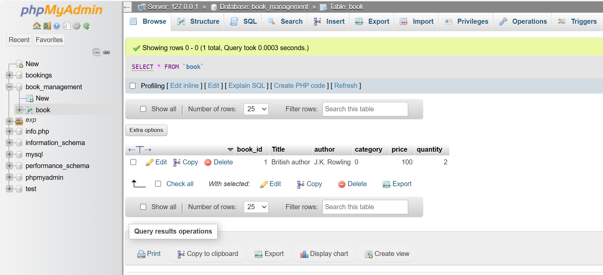

Introduction:
The Book Management System (BMS) is an innovative software solution aimed at automating and streamlining the management of books within various settings such as libraries, bookstores, and educational institutions. As the demand for efficient resource management grows, traditional manual methods of tracking and handling books become increasingly insufficient. The BMS addresses these challenges by providing a robust platform that enhances the organization, accessibility, and usability of book inventories. This system serves as a centralized hub for all book-related activities, enabling users to perform essential functions with ease. Key features include adding new books to the database, editing existing entries, removing outdated titles, and conducting searches based on multiple criteria like title, author, or genre. By digitizing these processes, the BMS reduces the time and effort required for manual record-keeping, thereby improving operational efficiency.
The BMS is designed with the end user in mind, prioritizing ease of use and accessibility. The interface is intuitive, allowing users with varying levels of technical expertise to navigate the system effortlessly. By integrating responsive design principles, the application ensures that users can access it from a wide range of devices, including desktops, tablets, and smartphones, making it convenient for on-the-go access.In an era where information is abundant yet often difficult to manage, the Book Management System stands as a critical tool for anyone who requires organized and effective management of literary resources. It not only simplifies the administrative tasks associated with book management but also enhances the user experience for readers and researchers seeking specific information.

Objectives of Book Management System:
The primary objectives of the Book Management System are as follows:
•	Streamlined Operations: To facilitate the efficient management of book records by automating processes that traditionally require extensive manual effort, thereby allowing staff to focus on higher-value activities.

•	User-Friendly Interface: To provide a straightforward and intuitive user interface that minimizes the learning curve for both administrators and end users, ensuring that all functionalities are easily accessible.

•	Role-Based Functionality: To implement a system that accommodates different user roles, such as administrators who manage the system and regular users who search for and view books. This enhances security and ensures that users have access to appropriate features based on their roles.

•	Enhanced Search Capabilities: To offer advanced search functionalities that allow users to quickly locate books based on various parameters, reducing time spent searching through physical or less organized digital inventories.

•	Data Integrity and Security: To maintain accurate and secure records of all book-related data through a reliable database management system (MySQL), ensuring that sensitive information is protected and that data remains consistent and valid.

•	Scalability: To build a system that can grow and adapt to the needs of users, allowing for the addition of new features and functionalities as the organization expands or as user needs evolve.

